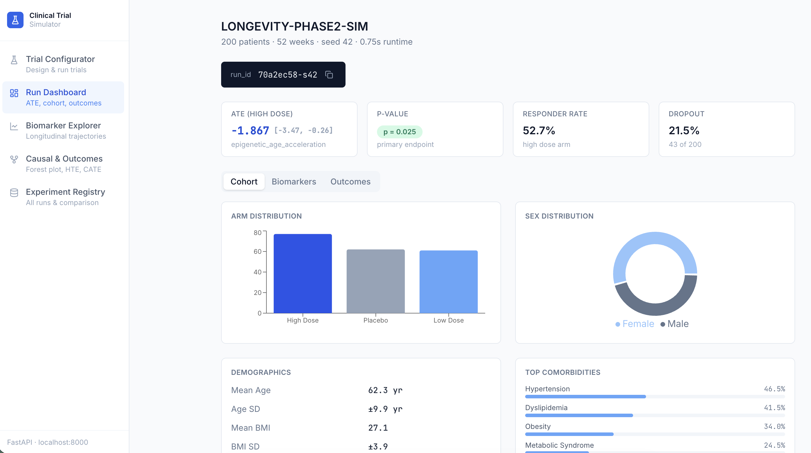
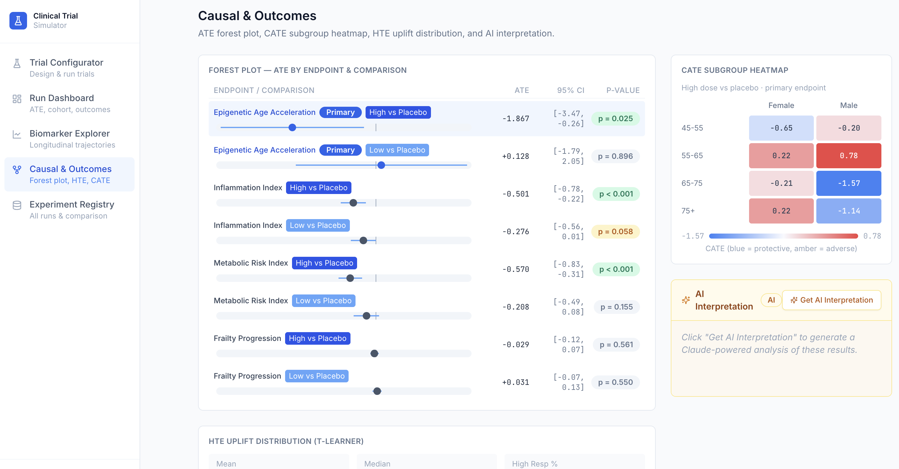

# Biotech Clinical Trials Simulator

An open-source distributed simulation platform for biotech clinical trials with causal AI, longitudinal longevity biomarker modelling, and agentic LLM interpretation. All patient data is synthetic.

---

## Screenshots

**Run Dashboard** — ATE scorecard, cohort charts, arm distribution, comorbidities


**Causal & Outcomes** — ATE forest plot, CATE subgroup heatmap, HTE uplift, Claude AI interpretation


---

## Architecture

```
┌─────────────────────────────────────────────────────────────┐
│                     FastAPI Serving Layer                   │
│   /simulate   /biomarkers   /agents/lint   /agents/interpret│
└──────────────────────┬──────────────────────────────────────┘
                       │
┌──────────────────────▼──────────────────────────────────────┐
│                   Agent Layer (LLMs)                        │
│  ProtocolLinter │ CohortNarrator │ ResultInterpreter        │
│  LLM reads summaries only — never generates numbers         │
└──────────────────────┬──────────────────────────────────────┘
                       │
┌──────────────────────▼──────────────────────────────────────┐
│               Simulation Engine                             │
│  PatientGenerator → BiomarkerSimulator → OutcomeModels      │
│  CausalDAG (SCM) → CausalEstimator (ATE / CATE / Uplift)   │
└──────────────────────┬──────────────────────────────────────┘
                       │
┌──────────────────────▼──────────────────────────────────────┐
│              Distributed Layer (Ray)                        │
│  @ray.remote tasks │ RayClusterManager │ Parameter sweeps   │
└──────────────────────┬──────────────────────────────────────┘
                       │
┌──────────────────────▼──────────────────────────────────────┐
│           Tracking + Drift Detection                        │
│   MLflow (config hash, ATE, cohort stats, artifacts)        │
│   KS-test │ PSI │ chi-squared │ biomarker mean drift         │
└─────────────────────────────────────────────────────────────┘
```

Hard architectural rule: The LLM agent layer sits above the simulation engine and reads structured summaries. It never writes back to the simulation kernel, never generates patient data, and is never the source of truth for any numeric outcome.

---

## Longevity Biomarkers (9 composite markers)

| Biomarker | Description |
|---|---|
| `inflammation_index` | CRP, IL-6, TNF-alpha composite |
| `metabolic_risk_index` | Fasting glucose, HbA1c, LDL/HDL ratio |
| `epigenetic_age_acceleration` | Biological vs chronological age gap (Horvath/GrimAge proxy) |
| `frailty_progression` | Grip strength, gait speed, exhaustion composite |
| `organ_reserve_score` | Kidney GFR, liver ALT/AST, cardiac LVEF proxy |
| `latent_mitochondrial_dysfunction` | VO2max decline, lactate threshold, NAD+ proxy |
| `immune_resilience` | Lymphocyte count, NK cell activity, regulatory T-cell ratio |
| `sleep_circadian_disruption` | PSQI proxy, melatonin rhythm, cortisol slope |
| `recovery_velocity` | Weeks to return to baseline after acute stress |

Generative model per biomarker:

```
y[t] = mu_arm(t)
       + rho*(y[t-1] - mu_baseline)   AR(1) mean-reversion
       + u_i                           patient random effect (fixed at enrolment)
       + eps_site                      site-specific assay noise
       + eps_residual                  residual stochastic noise
```

---

## Quick Start

### Option 1: One-click local (no Docker)

```bash
pip install -r requirements.txt
./start_cluster.sh

curl -s -X POST http://localhost:8000/simulate \
  -H "Content-Type: application/json" \
  -d '{"seed": 42, "n_patients": 200, "n_weeks": 52}' \
  | python3 -m json.tool

curl -s -X POST http://localhost:8000/simulate/sweep \
  -H "Content-Type: application/json" \
  -d '{"seeds": [42, 43, 44, 45], "n_patients": 100, "n_weeks": 26}' \
  | python3 -m json.tool
```

### Option 2: Docker Compose (full stack)

```bash
cp .env.example .env   # add ANTHROPIC_API_KEY=sk-ant-...
docker-compose up -d

# API:        http://localhost:8000/docs
# MLflow:     http://localhost:5000
# Ray:        http://localhost:8265
```

### Option 3: Ray sweep only

```bash
./start_cluster.sh --ray-only
python3 -c "
from src.utils.config import load_trial_config, load_biomarker_config
from src.distributed.ray_runner import RayClusterManager
trial_cfg = load_trial_config()
bio_cfg   = load_biomarker_config()
mgr = RayClusterManager(address='auto').init()
result = mgr.run_sweep(trial_cfg, bio_cfg, seeds=list(range(20)))
print(result.ate_summary_df())
"
```

---

## API Endpoints

| Method | Path | Description |
|---|---|---|
| GET | /health | Health check |
| POST | /simulate | Run a single simulation |
| GET | /simulate/{run_id} | Retrieve cached result |
| POST | /simulate/sweep | Ray-distributed parameter sweep |
| GET | /biomarkers/{run_id} | All biomarker summaries |
| GET | /biomarkers/{run_id}/{name} | Single biomarker trajectory |
| POST | /biomarkers/drift | Distribution drift detection |
| POST | /agents/lint | Protocol linting (rule-based + LLM) |
| POST | /agents/narrate | Cohort narrative generation |
| POST | /agents/interpret | Result interpretation and critique |
| POST | /agents/plan | Next-experiment planning |

Full interactive docs at http://localhost:8000/docs.

---

## LLM Agent Patterns

| Agent | Input | Output |
|---|---|---|
| ProtocolLinterAgent | Trial config dict | Lint report with ERRORS, WARNINGS, SUGGESTIONS |
| CohortNarratorAgent | Cohort summary stats | Clinical narrative (aggregate stats only) |
| ResultInterpreterAgent | Trial result summary | Scientific interpretation, statistical flags |
| ExperimentPlannerAgent | Goal + results | Ranked experiment plan with concrete config changes |

Set ANTHROPIC_API_KEY in your environment. All agents use claude-sonnet-4-6 by default. If the key is missing, agents return a fallback string and the simulation pipeline continues normally.

---

## Configuration

All parameters are in versioned YAML files under configs/. Every run_id is computed as `<config_hash>-s<seed>`. Identical config + seed produces identical results — this is the primary reproducibility guarantee.

Never modify a config mid-run. Create a new version instead. The config hash changes, producing a new run_id.

---

## Running Tests

```bash
pytest tests/ -v
pytest tests/ --cov=src --cov-report=term-missing
```

---

## Project Structure

```
biotech-clinical-trials-sim/
├── src/
│   ├── simulation/
│   │   ├── patient_generator.py     synthetic cohort (demographics, comorbidities, REs)
│   │   ├── biomarker_models.py      9 composite biomarkers with AR(1), assay noise
│   │   ├── causal_model.py          SCM DAG, do-calculus, ATE/CATE/uplift
│   │   ├── outcome_models.py        Weibull AFT, logistic, OLS, HTE uplift
│   │   └── trial_simulator.py       Orchestrator, versioned and seeded
│   ├── distributed/
│   │   ├── tasks.py                 @ray.remote simulation tasks
│   │   └── ray_runner.py            Cluster init, sweep launcher
│   ├── agents/
│   │   ├── base_agent.py            Anthropic SDK wrapper
│   │   ├── protocol_linter.py       I/E contradiction detection
│   │   ├── cohort_narrator.py       Cohort summary narration
│   │   └── result_interpreter.py   Outcome interpretation + experiment planner
│   ├── tracking/
│   │   └── experiment_tracker.py   MLflow integration
│   ├── api/
│   │   ├── main.py                  FastAPI app
│   │   ├── schemas.py               Pydantic request/response models
│   │   └── routes/
│   │       ├── simulation.py
│   │       ├── biomarkers.py
│   │       └── agents.py
│   └── utils/
│       ├── config.py                Pydantic settings, YAML loader, seed registry
│       └── drift_detector.py        KS-test, PSI, chi-squared, biomarker drift
├── configs/
│   ├── trial_config.yaml
│   └── biomarker_config.yaml
├── tests/
├── Dockerfile
├── docker-compose.yml
├── start_cluster.sh
└── requirements.txt
```

---

## Strongest Next Upgrades

1. Pluggable SCM DAG definitions, load from YAML without code changes
2. Survival model abstraction, plug in Cox PH, log-normal, or custom hazard functions
3. Causal uplift estimators, S-learner and X-learner via EconML/CausalML
4. Synthetic EHR event streams, FHIR-compatible via Ray actor streaming
5. GPU batch inference, add num_gpus=1 to Ray tasks and torch-based biomarker models
6. Kaplan-Meier dashboard with Plotly/Streamlit, forest plots, cohort balance
7. Ray Serve inference layer for real-time what-if queries

---

## Data Privacy

All patient data is synthetic and generated from statistical priors. No real patient records are used or stored. If extending with real data: apply differential privacy before any aggregates leave the pipeline, de-identify per HIPAA Safe Harbor or GDPR pseudonymisation requirements, and never pass individual records to the LLM agent layer.

---

## License

Apache 2.0

---

<!-- SEO -->
<details>
<summary>Keywords & Topics</summary>

**Clinical trial simulation** · **synthetic patient data** · **causal inference** · **average treatment effect (ATE)** · **conditional average treatment effect (CATE)** · **heterogeneous treatment effects (HTE)** · **T-Learner uplift model** · **Weibull AFT survival model** · **longitudinal biomarker modelling** · **epigenetic age acceleration** · **longevity biomarkers** · **inflammation index** · **frailty progression** · **metabolic risk** · **immune resilience** · **drug trial simulation** · **phase 2 trial** · **phase 3 trial** · **randomised controlled trial (RCT)** · **placebo-controlled trial** · **biostatistics** · **survival analysis** · **Kaplan-Meier** · **forest plot** · **subgroup analysis** · **dose-response** · **protocol linting** · **drift detection** · **KS test** · **population shift** · **Ray distributed computing** · **FastAPI** · **React dashboard** · **Recharts** · **Tailwind CSS** · **Claude AI** · **Anthropic** · **agentic LLM** · **clinical AI** · **drug discovery** · **bioinformatics** · **precision medicine** · **digital twin** · **synthetic EHR** · **HIPAA-safe** · **GxP** · **FDA clinical trial** · **ICH E9** · **estimand framework** · **open source biotech** · **computational biology** · **pharmacokinetics simulation** · **oncology trial** · **longevity research** · **healthspan** · **geroscience** · **aging biomarkers** · **NAD+** · **VO2max** · **GrimAge** · **Horvath clock** · **MLflow experiment tracking** · **reproducible research** · **seeded simulation** · **Monte Carlo clinical trial**

</details>